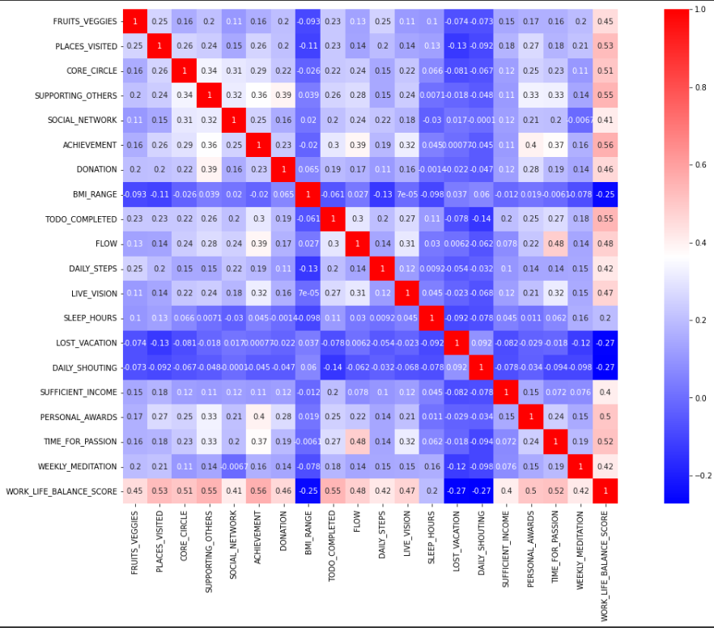
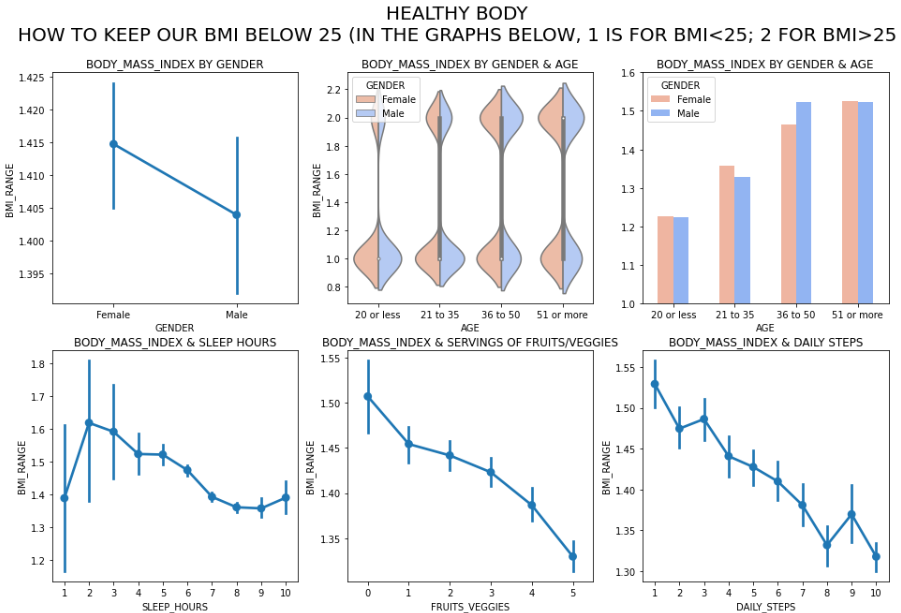
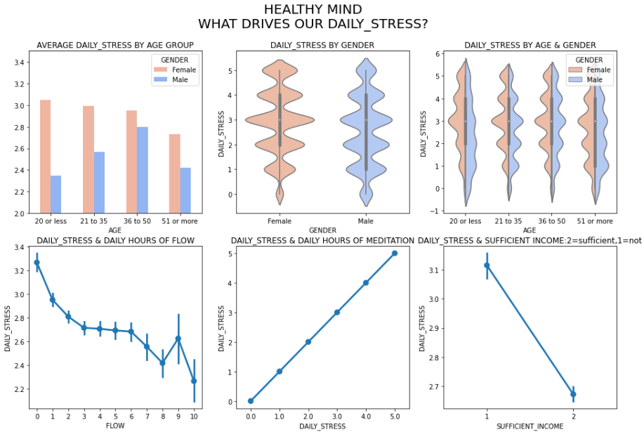
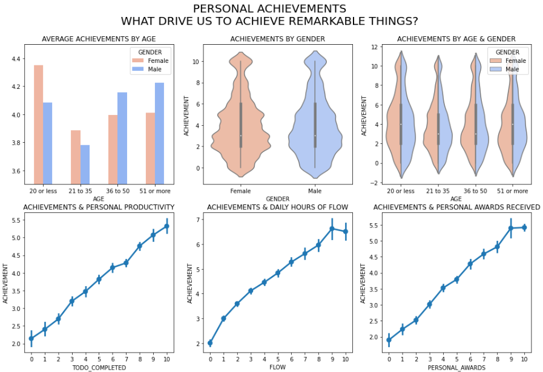

# 📊 Lifestyle Analysis Project  

This project explores the association between various lifestyle factors such as **BMI, stress, sleep hours, achievements, and social connections** using the **Wellbeing and Lifestyle dataset from Kaggle**.  

---

## 📌 Overview  
The goal of this project is to analyze the impact of different lifestyle choices on well-being and identify key patterns using **EDA (Exploratory Data Analysis)** and **machine learning models**.  

### 🔍 **Key Questions Explored:**  
- Does **stress** affect **sleep hours** and **work-life balance**?  
- How is **BMI** related to **daily steps, food intake, and exercise**?  
- Does maintaining a **core circle of friends** impact stress levels?  
- How does **meditation** influence productivity and achievements?  
- What factors contribute most to **work-life balance**?  



---

## 📂 Dataset Information  
- **Source**: [Wellbeing and Lifestyle Dataset (Kaggle)](https://www.kaggle.com/)  
- **Features Used**:  
  - `BMI_RANGE` - Body Mass Index category  
  - `SLEEP_HOURS` - Average sleep duration  
  - `DAILY_STRESS` - Self-reported stress level  
  - `ACHIEVEMENT` - Personal accomplishments score  
  - `CORE_CIRCLE` - Number of close friends  
  - `DAILY_STEPS` - Number of steps walked per day  
  - `TODO_COMPLETED` - Completed tasks  
  - `FLOW` - State of productivity  
  - `LOST_VACATION` - Days of unused vacation  

---

## 📊 Exploratory Data Analysis (EDA)  

### 🔹 **1. Correlation Analysis**  
A **heatmap** reveals the relationships between key lifestyle variables.  

```python
import seaborn as sns
import matplotlib.pyplot as plt

plt.figure(figsize=(10,6))
sns.heatmap(df.corr(), annot=True, cmap='coolwarm')
plt.title("Correlation Heatmap")
plt.show()
